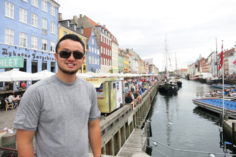

Richard Van is a developer who is well-rounded with experience in attempting his own startup, traveling the world, and working in industry for five years.  He enjoys exploring new technologies and leveraging code to do cool things.

[文](https://en.wiktionary.org/wiki/%E6%96%87)[英](https://en.wiktionary.org/wiki/%E8%8B%B1)[康](https://en.wiktionary.org/wiki/%E6%96%87) is his Chinese name. The Cantonese translation is Man Jing Hong; The Mandarin translation is Wen Ying Kang; The Vietnamese translation is [Văn](https://en.wiktionary.org/wiki/v%C4%83n#Vietnamese) [Anh](https://en.wiktionary.org/wiki/Anh) [Khăng](http://meaningoffirstname.blogspot.com/2009/08/khang-name-meanings-of-khang-baby-names.html). He speaks Cantonese at home with his family and is commonly referred to as Hong.

In his early life, he was born in Reno, Nevada where he attended public school for K-12 education.

He received a B.S. in [Computer Science](http://www.cs.ucla.edu/) in 2010, from the University of California, Los Angeles; and a Master's of [Business Administration ](http://www.unr.edu/degrees/business-administration/mba) in 2013, from the University of Nevada, Reno.

He was formerly a software engineer at [International Game Technology](https://www.igt.com/) with five years of work experience,  full-time (June 2010 to May 2014), and two internships (Summer 2008 and Summer 2009) where he worked on in-house casino software and mobile apps. 

During his time at IGT, he took night classes at the local university to earn his MBA.  The MBA has served him to better understand corporate culture and the financial side of life.

In 2014 he gracefully quit his job and did some long-term traveling to learn more about the world and himself, he traveled through over twenty [countries](http://richardvan.com/pages/travel.html) for six months.

In 2015 he and his friend bootstrapped their own startup idea that focused on Nightlife Events Planning called [SinPal](http://richardvan.com/pages/startup.html). The idea didn't gain the traction they aimed for but they both learned a lot from the experience.

Outside of his professional career, he also has work experience in both customer service  and construction projects.  His first job as a teenager was a dishwasher for the family restaurant business where he learned to work as a cashier, bus boy, and waiter;  From time to time, he finds himself working with his father on a construction projects centering around renovations of commercial and residential properties.

Leisurely he enjoys reading, exercising, cooking, walking his dog, watching sports, snowboarding/skiing, scuba diving, tinkering with the [arduino](https://www.arduino.cc/), and listening to music.

He currently lives in Las Vegas and enjoys being around family, friends, and his dogs. He is currently open to job opportunities as a software developer ([resume ]({{ BASE_PATH }}/assets/RichardVanResume.pdf)).

---

<h4>contact</h4>

    

        

            Richard Van 
            Las Vegas, Nevada 
            USA  

            

            Email: <code>van</code><b>I</b><code>richard</code><b>don't</b><code>@</code><b>want</b><code>g</code><b>spam!
            </b><code>mail</code><b>So</b><code>.</code><b>please</b><code>c</code><b>leave
            </b><code>om</code><b>me</b><b>alone</b><b>!</b> 
            

        

        

        
        

    

